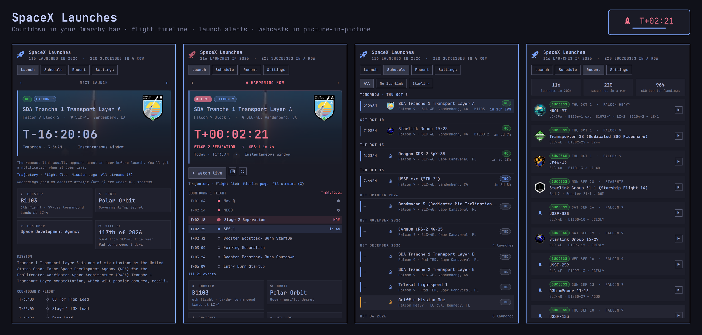

# SpaceX Launches (grivera.spacex)

Every upcoming SpaceX launch in your Omarchy bar: a live T-minus countdown, booster, weather and crew details, the flight timeline lighting up event by event, launch alerts, and the webcast in a picture-in-picture window. Replays of recent launches start 90 seconds before liftoff.



Launch data comes from The Space Devs' [Launch Library 2](https://thespacedevs.com/llapi), a free community-maintained API. You don't need an account or an API key.

## Install

Use Omarchy's plugin manager:

```
omarchy plugin add https://github.com/grivera82/omarchy-spacex.git --enable
```

This clones the plugin into `~/.config/omarchy/plugins/grivera.spacex`, checks it, and adds the rocket to your bar. When run interactively, it asks which bar section to use (default: right). Without `--enable`, you can turn it on later with:

```
omarchy plugin enable grivera.spacex --section right
```

To update or uninstall:

```
omarchy plugin update grivera.spacex
omarchy plugin disable grivera.spacex   # hide it but keep it installed
~/.config/omarchy/plugins/grivera.spacex/bin/spacex stop   # close the player first
omarchy plugin remove grivera.spacex    # delete it
rm -rf ~/.cache/grivera-spacex ~/.local/state/grivera-spacex   # optional: cache and settings
```

The plugin never changes your Omarchy or Hyprland configuration. It only writes to the folders listed under [Files](#files).

## What it does

- **In the bar:** a rocket icon. A dot appears when a launch is under 24 hours away and turns red and pulses while a webcast is live. In the last hour the icon becomes a countdown (`T-12:04`). After liftoff it shows the mission clock and the current event (`T+02:14 · MECO`). Left-click opens the panel. Right-click plays the live webcast (or stops the player). Middle-click refreshes.
- **Launch tab:** the mission photo and patch, status (GO / TBC / TBD / HOLD), the countdown with your local time and the launch window, and buttons to watch in picture-in-picture or fullscreen. It also shows the booster (serial, flight number, turnaround, droneship or landing zone), orbit, weather odds, customer, Dragon capsule and crew, SpaceX's launch count for the year, the mission description, and the latest note from the Launch Library editors. Use `←`/`→` to step through launches.
- **Countdown & flight timeline:** every event from "GO for prop load" to booster landing, with times relative to T-0. During a launch, the current event is highlighted, the next one counts down, and the timeline moves above everything else.
- **Schedule tab:** a calendar of the next 25 launches grouped by day, with your local times and countdowns. Launches without a firm date are grouped by month or quarter (in UTC, so "NET December" doesn't turn into Nov 30). Filters: All, No Starlink, or Starlink only.
- **Recent tab:** results with booster landing outcomes, plus SpaceX's year count, success streak and landing rate. ▶ starts the replay 90 seconds before liftoff.
- **Alerts:** a reminder before a launch that's GO (10 minutes to 2 hours ahead), when the webcast goes live, liftoff, the result, and scrubs, delays or holds for launches in the next three days. Reminder and webcast notifications have a **Watch** button. Starlink alerts are off by default because Starlink makes up most of the manifest.
- **The player:** webcasts play in mpv through yt-dlp. That covers SpaceX's official broadcasts on X and the YouTube coverage from NASASpaceflight, Spaceflight Now, Everyday Astronaut, NASA and others. Picture-in-picture uses Omarchy's own PiP window rule, so the video floats pinned in the top-right corner on every workspace. Recordings from an earlier, scrubbed attempt are labeled as such and never played by mistake.

## Keyboard

In the panel: `1`–`4` switch tabs, `←`/`→` (`h`/`l`) step through launches, `w` watch, `p` picture-in-picture, `f` fullscreen, `s` stop, `n` jump back to the next launch, `r` refresh.

From a keybinding or terminal:

```
~/.config/omarchy/plugins/grivera.spacex/bin/spacex next      # one line: next launch and countdown
~/.config/omarchy/plugins/grivera.spacex/bin/spacex status    # the next ten launches and recent results
~/.config/omarchy/plugins/grivera.spacex/bin/spacex watch [--pip|--window|--fullscreen]
~/.config/omarchy/plugins/grivera.spacex/bin/spacex watch <launch-id> --liftoff
~/.config/omarchy/plugins/grivera.spacex/bin/spacex stop
~/.config/omarchy/plugins/grivera.spacex/bin/spacex demo 120  # preview the panel as if T-0 was 2 minutes ago (for an hour)
~/.config/omarchy/plugins/grivera.spacex/bin/spacex demo off
```

## Status for scripts and voice assistants

`omarchy-shell grivera.spacex status` prints a JSON summary: the next launches with countdowns, pads, orbits, boosters and crews, plus recent results. Voice assistants such as [Jarvis](https://github.com/grivera82/omarchy-jarvis) use it to answer questions. It only reads, and works while the widget is in the bar.

## Requirements

- Python 3 (standard library only)
- `mpv` and `yt-dlp` to watch webcasts. Without them, webcast links open in your browser.

## Rate limits

Launch Library's free tier allows 15 requests an hour per IP address. The daemon keeps its own rolling budget of 12, so a manual refresh or another app on your network still has some room. The schedule is cached on disk and reloads don't refetch it. The plugin checks for updates every 30 minutes normally, every 15 minutes on launch day or while the panel is open, and every 6 minutes from two hours before T-0 until the flight ends. Results are fetched about 20 minutes after a launch. If the API returns a rate-limit error, the plugin waits as long as the API asks.

## Files

| Path | What |
| --- | --- |
| `~/.cache/grivera-spacex/upcoming.json`, `previous.json` | cached Launch Library responses |
| `~/.cache/grivera-spacex/img/` | mission patches and launch photos (cleaned up after 45 days) |
| `~/.cache/grivera-spacex/budget.json` | request timestamps for the hourly budget |
| `~/.local/state/grivera-spacex/config.json` | your settings |
| `~/.local/state/grivera-spacex/notified.json` | which alerts were already sent |
| `~/.local/state/grivera-spacex/player.json`, `player.log` | the running player, and mpv's output for troubleshooting |

## Credits

Launch data, images and webcast links come from [The Space Devs](https://thespacedevs.com) (Launch Library 2). Mission patches and photos belong to their owners, mostly SpaceX (CC BY-NC 2.0). Trajectory links go to [Flight Club](https://flightclub.io). This plugin isn't affiliated with SpaceX.

## License

MIT
